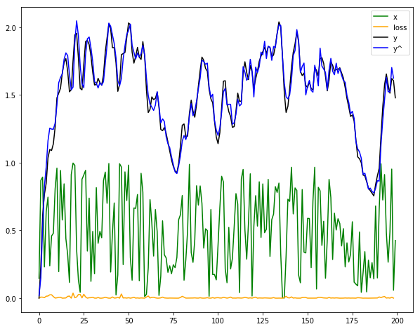
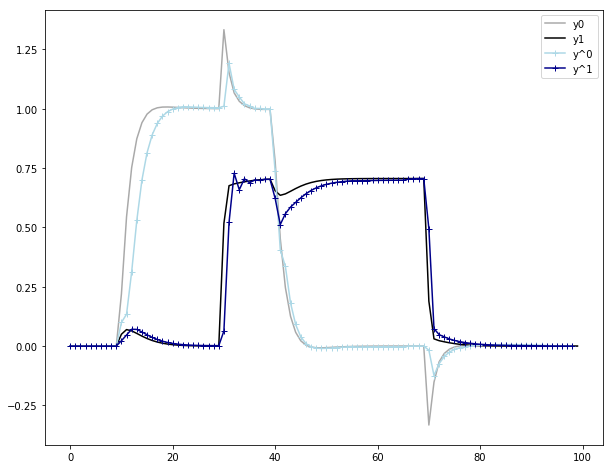

# ldssf
NIPS 2017 Paper implementation challenge [Learning Linear Dynamic Systems via Spectral Filtering](https://arxiv.org/abs/1711.00946v1)

## Brief explaination
The algorithm described in this paper belongs to the field of online convex optimization. It is a decision system that tries
to best guess the next result, `y(t), t=n` given the input `x(t), t=1,..,n` and the history of `y(t), t=1,..,n-1`.
It does this by learning from the previous results.

The algorithm assumes a linear dynamic system that can be represented
in terms of ordinary differential equations. These ODEs are unknown and the assumption is that by adding additional
input parameters, using the eigen vectors and eigen values of a so called Hankel matrix, the upper bound of the result can
be predicted.

## Requirements
- scipy
- numpy
- matplotlib

## Results and consideration
The figures below show the results of a SISO and a double input and double output linear dynamic system.

The algorithm turns out to be sensitive for the learning rate. This learning rate must be has high as
possible without *overshooting* the result. When the learning rate is to small, the prediction will never
near the output.
